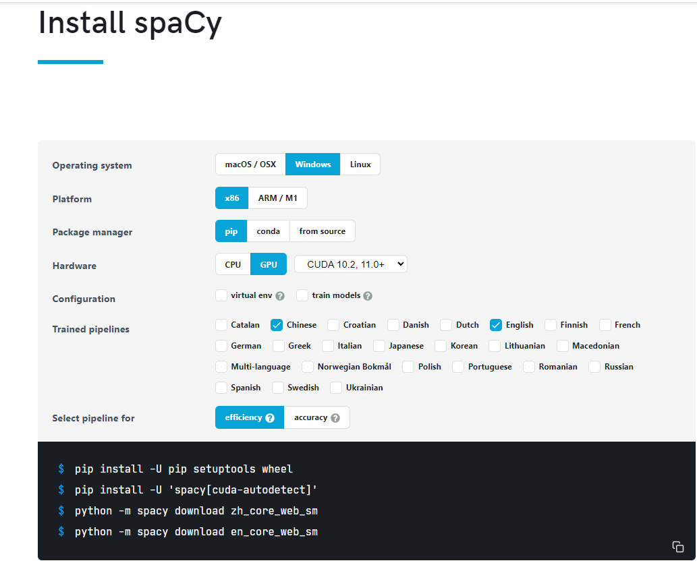

## A Transformer Framework Based Translation Task
### 一个基于Transformer网络结构的文本翻译模型

### 论文[Attention Is All You Need](https://arxiv.org/abs/1706.03762) 基于PyTorch的实现

##### 声明：本工程源自https://github.com/moon-hotel/TransformerTranslation

## 1. 环境准备



```
matplotlib==3.5.3
numpy==1.20.0
packaging==21.3
pandas==1.3.5
sacrebleu==2.3.1
scipy==1.4.1
setuptools==65.5.0
torch==1.12.1+cu116
torchtext==0.6.0
tqdm==4.64.1
transformers==4.24.0
# 使用spacy进行英语分词
python -m spacy download en_core_web_sm
# 使用spacy进行汉语分词
python -m spacy download zh_core_web_sm
```


## 2. 使用方法
* STEP 1. 按照模型数据集格式进行改造数据集
* STEP 2. 可自定义修改配置文件`config.py`中的配置参数，也可以保持默认
### 2.1 训练
直接执行如下命令即可进行模型训练：
```
python train.py
```
训练过程：
```python
Epoch: 2, Train loss: 5.685, Train acc: 0.240947
Epoch: 2, Train loss: 5.668, Train acc: 0.241493
Epoch: 2, Train loss: 5.714, Train acc: 0.224682
Epoch: 2, Train loss: 5.660, Train acc: 0.235888
Epoch: 2, Train loss: 5.584, Train acc: 0.242052
Epoch: 2, Train loss: 5.611, Train acc: 0.243428
```
学习率变化：


## 2.2 预测（inference）
直接运行如下命令即可：

```
python translate.py
```

示例结果：

```python
德语：Eine Gruppe von Menschen steht vor einem Iglu.
翻译：A group of people standing in fraon of an igloo .
英语：A group of people are facing an igloo.
=========
德语：Ein Mann in einem blauen Hemd steht auf einer Leiter und putzt ein Fenster.
翻译：A man in a blue shirt is standing on a ladder cleaning a window.
英语：A man in a blue shirt is standing on a ladder cleaning a window.
```
## 3. 结果
bleu评测结果

|val | test_2016_flickr |
|--|--|
| | |
